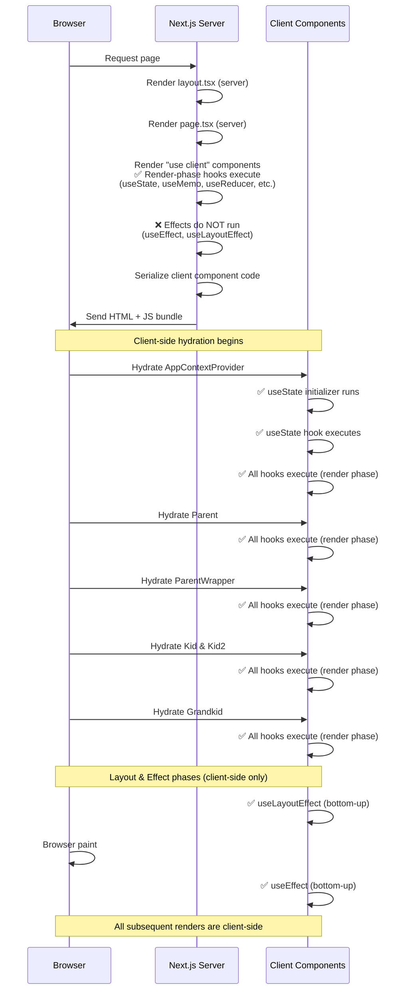
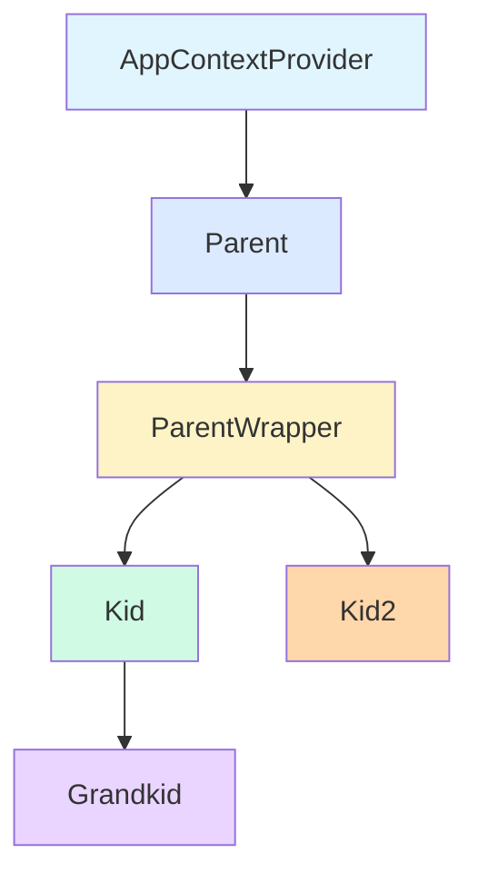
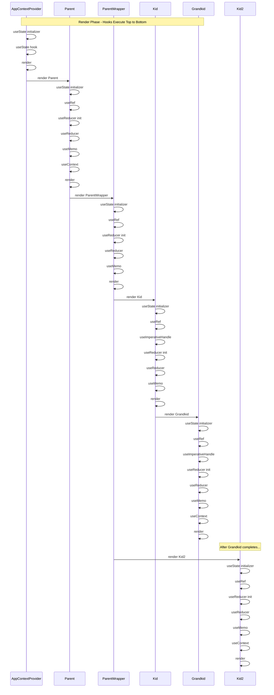
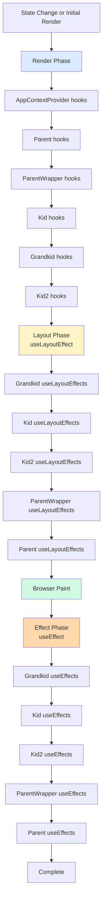

# React Hooks Execution Order Visualization

A Next.js application that demonstrates and visualizes the execution order of React hooks in a component tree. This app helps developers understand when hooks execute during React's render cycle, both with and without the React Compiler.

## Overview

This project showcases the precise order in which React hooks execute during:
- **Render Phase**: When components render and hooks are called
- **Layout Phase**: When `useLayoutEffect` hooks run (synchronously after DOM mutations)
- **Effect Phase**: When `useEffect` hooks run (asynchronously after paint)

The app includes two versions:
- **Without React Compiler**: Standard React behavior
- **With React Compiler**: React Compiler optimized behavior

## Server vs Client Execution

This is a Next.js App Router application, which means there's a clear distinction between what runs on the server and what runs on the client.

### Server Components (No Hooks)

The following components run on the **server** during Server-Side Rendering (SSR):

- **`app/layout.tsx`**: Root layout component (server component)
  - Sets up HTML structure, fonts, and global styles
  - Runs once per request on the server
  - Cannot use React hooks

- **`app/page.tsx`**: Home page (server component)
  - Renders the navigation links
  - Runs on the server during initial page load
  - Cannot use React hooks

- **`app/without-compiler/page.tsx`**: Without compiler page (server component)
  - Renders the page wrapper and imports the client component
  - Runs on the server during initial page load
  - Cannot use React hooks

- **`app/with-compiler/page.tsx`**: With compiler page (server component)
  - Renders the page wrapper and imports the client component
  - Runs on the server during initial page load
  - Cannot use React hooks

### Client Components ("use client" - Hooks Execute Here)

All components that use hooks are marked with `"use client"` and run in the **browser**:

- **`app/components/without-compiler/*`**: All components without compiler
  - `AppContext.tsx` - Context provider with hooks
  - `Parent.tsx` - Parent component with hooks
  - `ParentWrapper.tsx` - Wrapper component with hooks
  - `Kid.tsx` - Child component with hooks
  - `Kid2.tsx` - Sibling component with hooks
  - `Grandkid.tsx` - Grandchild component with hooks

- **`app/components/compiler/*`**: All components with compiler
  - Same structure as above, but with React Compiler optimizations

### What Runs on Server vs Client for "use client" Components

When a component is marked with `"use client"`, here's what happens:

#### On the Server (SSR):
- ✅ **Component code is bundled** and sent to the client
- ✅ **JSX structure is rendered** to generate initial HTML
- ✅ **Render-phase hooks execute** on the server (to generate initial HTML)
- ✅ **Hook initializers run** (e.g., `useState(() => ...)`, `useReducer(..., init)`)
- ✅ **Hook logic executes** (e.g., `useMemo`, `useReducer`, `useContext`, `useRef`)
- ✅ **`useCallback` returns a function** on the server (memoized function is created during render)
- ❌ **Effects DO NOT run** (`useEffect`, `useLayoutEffect` - these are client-only)

#### On the Client (Hydration):
- ✅ **All hooks execute** during hydration (the first client-side render)
- ✅ **Hook initializers run** (e.g., `useState(() => ...)`)
- ✅ **All hook logic executes** (e.g., `useMemo`, `useReducer`, `useContext`)
- ✅ **Effects run** after hydration completes (`useLayoutEffect` then `useEffect`)

#### After Hydration (Client-Side Renders):
- ✅ **All subsequent renders happen client-side**
- ✅ **Hooks execute normally** on every re-render
- ✅ **Effects run** according to their dependency arrays

### Execution Flow Diagram



### Key Points About Hook Execution

1. **Server-Side Rendering (SSR)**:
   - Server components render HTML structure
   - Client components' JSX is rendered to HTML
   - **Render-phase hooks execute on the server** (useState, useMemo, useReducer, useRef, useContext, etc.)
   - **Hook initializers run on the server** (e.g., `useState(() => ...)`, `useReducer(..., init)`)
   - **Effects do NOT run on the server** (useEffect, useLayoutEffect are client-only)

2. **Client-Side Hydration**:
   - React "hydrates" the server-rendered HTML
   - **All render-phase hooks execute again** during hydration
   - **Hook initializers run again** (but should return the same values as server)
   - Hook execution order follows the same rules as server-side renders
   - **Hydration must match server output** - React will warn if there are mismatches

3. **Subsequent Renders**:
   - All re-renders happen **entirely client-side**
   - Hooks execute normally on every render
   - Effects run according to their dependency arrays

4. **Console Logs**:
   - Hook execution logs appear in **both server logs (during SSR) and browser console (during hydration)**
   - In development, you'll see server-side hook execution in terminal/server logs
   - In the browser console, you'll see client-side hook execution (hydration + subsequent renders)
   - The first render you see in the browser console is the hydration render (hooks execute again to match server output)

### Why This Matters

- **Initial Load**: Server components render HTML on the server for faster initial page load
- **Interactivity**: Client components enable interactivity and state management with hooks
- **Performance**: Server components reduce JavaScript bundle size sent to the client
- **Hook Execution**: All hook execution you observe happens in the browser, not on the server
- **Hydration**: The first hook execution you see in the console is during hydration, which matches the execution order of subsequent client-side renders

## Getting Started

First, install dependencies:

```bash
npm install
# or
yarn install
# or
pnpm install
```

Then, run the development server:

```bash
npm run dev
# or
yarn dev
# or
pnpm dev
```

Open [http://localhost:3000](http://localhost:3000) with your browser to see the result.

## Component Hierarchy

The app demonstrates hooks execution across a nested component tree:

```
AppContextProvider
└── Parent
    └── ParentWrapper
        ├── Kid
        │   └── Grandkid
        └── Kid2
```

## React Hooks Execution Order Cheatsheet

### Component Hierarchy Diagram



### Render Phase: Hook Execution Order

During the render phase, hooks execute in a **top-down, depth-first** order as React traverses the component tree:



### Hook Execution Order Within a Component

Within each component, hooks execute in the order they are declared:


### Effect Phase: useLayoutEffect and useEffect Order

After the render phase completes, effects run in a **bottom-up** order (children first, then parents):

```mermaid
sequenceDiagram
    participant G as Grandkid
    participant K as Kid
    participant K2 as Kid2
    participant PW as ParentWrapper
    participant P as Parent
    
    Note over G,P: Layout Phase - useLayoutEffect (Synchronous)
    
    G->>G: useLayoutEffect cleanup (if re-render)
    G->>G: useLayoutEffect (no deps)
    G->>G: useLayoutEffect cleanup (mount)
    G->>G: useLayoutEffect (mount)
    G->>G: useLayoutEffect cleanup (deps)
    G->>G: useLayoutEffect (deps)
    
    K->>K: useLayoutEffect cleanup (if re-render)
    K->>K: useLayoutEffect (no deps)
    K->>K: useLayoutEffect cleanup (mount)
    K->>K: useLayoutEffect (mount)
    K->>K: useLayoutEffect cleanup (deps)
    K->>K: useLayoutEffect (deps)
    
    K2->>K2: useLayoutEffect cleanup (if re-render)
    K2->>K2: useLayoutEffect (no deps)
    K2->>K2: useLayoutEffect cleanup (mount)
    K2->>K2: useLayoutEffect (mount)
    K2->>K2: useLayoutEffect cleanup (deps)
    K2->>K2: useLayoutEffect (deps)
    
    PW->>PW: useLayoutEffect cleanup (if re-render)
    PW->>PW: useLayoutEffect (no deps)
    PW->>PW: useLayoutEffect cleanup (mount)
    PW->>PW: useLayoutEffect (mount)
    PW->>PW: useLayoutEffect cleanup (deps)
    PW->>PW: useLayoutEffect (deps)
    
    P->>P: useLayoutEffect cleanup (if re-render)
    P->>P: useLayoutEffect (no deps)
    P->>P: useLayoutEffect cleanup (mount)
    P->>P: useLayoutEffect (mount)
    P->>P: useLayoutEffect cleanup (deps)
    P->>P: useLayoutEffect (deps)
    
    Note over G,P: Effect Phase - useEffect (Asynchronous, after paint)
    
    G->>G: useEffect cleanup (if re-render)
    G->>G: useEffect (no deps)
    G->>G: useEffect cleanup (mount)
    G->>G: useEffect (mount)
    G->>G: useEffect cleanup (deps)
    G->>G: useEffect (deps)
    
    K->>K: useEffect cleanup (if re-render)
    K->>K: useEffect (no deps)
    K->>K: useEffect cleanup (mount)
    K->>K: useEffect (mount)
    K->>K: useEffect cleanup (deps)
    K->>K: useEffect (deps)
    
    K2->>K2: useEffect cleanup (if re-render)
    K2->>K2: useEffect (no deps)
    K2->>K2: useEffect cleanup (mount)
    K2->>K2: useEffect (mount)
    K2->>K2: useEffect cleanup (deps)
    K2->>K2: useEffect (deps)
    
    PW->>PW: useEffect cleanup (if re-render)
    PW->>PW: useEffect (no deps)
    PW->>PW: useEffect cleanup (mount)
    PW->>PW: useEffect (mount)
    PW->>PW: useEffect cleanup (deps)
    PW->>PW: useEffect (deps)
    
    P->>P: useEffect cleanup (if re-render)
    P->>P: useEffect (no deps)
    P->>P: useEffect cleanup (mount)
    P->>P: useEffect (mount)
    P->>P: useEffect cleanup (deps)
    P->>P: useEffect (deps)
```



### Complete Render Cycle Flow



## Key Concepts

### Render Phase (Top-Down)
- Hooks execute **during render**, in the order they appear in code
- Parent components' hooks run before children's hooks
- Siblings execute left-to-right (or in JSX order)

### Layout Phase (Bottom-Up)
- `useLayoutEffect` runs **synchronously** after DOM mutations
- Runs **before** the browser paints
- Executes in **bottom-up** order (children first, then parents)
- Cleanup functions run before new effects

### Effect Phase (Bottom-Up)
- `useEffect` runs **asynchronously** after the browser paints
- Executes in **bottom-up** order (children first, then parents)
- Cleanup functions run before new effects
- Multiple effects with different dependency arrays run in declaration order

### Hook Execution Rules

1. **Hooks must be called in the same order every render**
2. **Hooks cannot be called conditionally or in loops**
3. **Render phase hooks** (useState, useRef, useMemo, etc.) execute top-down
4. **Effect hooks** (useEffect, useLayoutEffect) execute bottom-up
5. **Cleanup functions** run before new effects in the same phase

## Hooks Demonstrated

This app demonstrates the following React hooks:

- **`useState`**: State management with lazy initializers
- **`useRef`**: DOM references and mutable values
- **`useReducer`**: Complex state management with lazy initialization
- **`useMemo`**: Memoized computed values
- **`useContext`**: Context consumption
- **`useEffect`**: Side effects (async, after paint)
- **`useLayoutEffect`**: Synchronous side effects (before paint)
- **`useImperativeHandle`**: Exposing imperative methods via refs (with `forwardRef`)

## Usage

1. Navigate to the home page to choose between:
   - **Without React Compiler**: Standard React behavior
   - **With React Compiler**: React Compiler optimized behavior

2. Open your browser's developer console to see the hook execution order

3. Interact with the buttons to trigger state changes and observe:
   - Hook execution order during re-renders
   - Cleanup function execution
   - Effect dependency tracking

## Project Structure

```
app/
├── components/
│   ├── compiler/          # Components with React Compiler
│   │   ├── AppContextWithCompiler.tsx
│   │   ├── ParentWithCompiler.tsx
│   │   ├── ParentWrapperWithCompiler.tsx
│   │   ├── KidWithCompiler.tsx
│   │   ├── Kid2WithCompiler.tsx
│   │   └── GrandkidWithCompiler.tsx
│   └── without-compiler/  # Components without React Compiler
│       ├── AppContext.tsx
│       ├── Parent.tsx
│       ├── ParentWrapper.tsx
│       ├── Kid.tsx
│       ├── Kid2.tsx
│       └── Grandkid.tsx
├── with-compiler/
│   └── page.tsx
├── without-compiler/
│   └── page.tsx
└── page.tsx               # Home page
```

## Technologies

- **Next.js 16.1.1**: React framework
- **React 19.2.3**: UI library
- **React Compiler**: Automatic memoization and optimization
- **TypeScript**: Type safety
- **Tailwind CSS**: Styling

## Learn More

- [React Hooks Documentation](https://react.dev/reference/react)
- [React Compiler](https://react.dev/learn/react-compiler)
- [Next.js Documentation](https://nextjs.org/docs)

## License

This project is open source and available for educational purposes.
